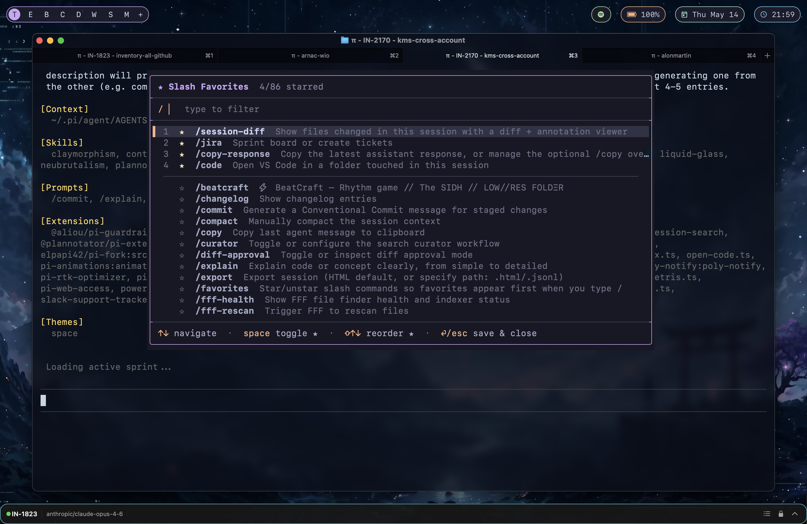
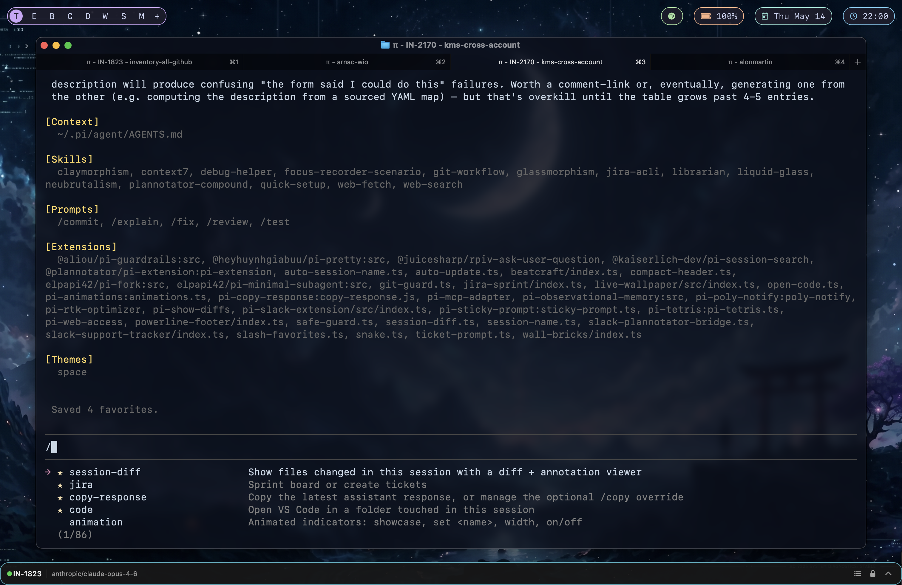

# pi-favorites-commands

> Star and reorder your favorite slash commands in [pi](https://github.com/badlogic/pi-mono).
> Favorites appear at the top of the `/` autocomplete dropdown with a ★ glyph, in the order you choose.

| `/favorites` manager | `/` dropdown |
| :---: | :---: |
|  |  |

## Why

Pi has a lot of slash commands once you install a few extensions, themes,
skills, and prompt templates. The autocomplete dropdown sorts them
alphabetically, which means `/code` and `/session-diff` — the two you
actually use ten times a day — live a long scroll away from `/c`.

This extension lets you **star** the commands you use most and **reorder**
them however you like. Stars are persisted to disk and survive `/reload`
and pi restarts.

## Features

- ⭐ **Star any slash command** — built-ins (`/settings`, `/compact`, …),
  extension commands, prompt templates, and skill commands all work.
- 🔝 **Favorites surface first** when you type `/`, in your custom order,
  each prefixed with a yellow ★ so they're easy to spot.
- ↕️ **Manual reorder** with `⇧↑` / `⇧↓` inside the manager — no
  alphabetical lock-in.
- 🔎 **Live filter** — type to search the picker by command name or
  description.
- 💾 **Persistent** — saved to `~/.pi/agent/data/slash-favorites.json` as a
  plain JSON array. Edit it by hand if you want.
- 🪶 **Zero runtime deps** — pure TypeScript, uses only `@mariozechner/pi-coding-agent`
  and `@mariozechner/pi-tui` (peer-provided by pi itself).

## Install

```bash
pi install npm:pi-favorites-commands
```

Reload pi (`/reload`) or start a fresh session. The autocomplete provider
is installed automatically.

## Usage

### Manage stars

```
/favorites
```

Opens a centered overlay with every slash command in your session
(built-ins + extension + prompt template + skill commands that pi
itself reports).

| Key            | Action                                                    |
| -------------- | --------------------------------------------------------- |
| `↑` / `↓`      | Move cursor                                               |
| `space`        | Toggle ★ on current command                               |
| `⇧↑` / `⇧↓`    | Move the selected favorite up / down within the ★ section |
| Any text       | Filter commands by name or description                    |
| `backspace`    | Edit filter                                               |
| `⏎` / `esc`    | Save & close                                              |

Newly-starred commands are appended to the **end** of your favorites list
so you can decide where they belong. The numeric rank shown next to each
★ is the position you'll see them in when typing `/`.

### Use the favorites

Just type `/`. Your starred commands are at the top of the dropdown, in
your order, each prefixed with a yellow ★. Unstarred commands follow
alphabetically.

## Storage

Favorites live at:

```
~/.pi/agent/data/slash-favorites.json
```

It's a plain JSON array of command names in display order. Example:

```json
[
  "code",
  "jira",
  "session-diff",
  "copy-response"
]
```

You can edit it by hand or sync it across machines via dotfiles.

## How it works

Pi exposes hooks for extensions to replace the editor component. This
extension installs a `CustomEditor` subclass that pins its autocomplete
provider to a small wrapper around pi's built-in
`CombinedAutocompleteProvider`. The wrapper:

1. Sorts the command list so favorites come first (in user order), then
   the rest alphabetically.
2. Decorates each suggestion's `label` with `★ ` for starred entries so
   the glyph appears next to the command in the dropdown — without
   affecting what actually gets inserted when you press `⏎`.

Pi's core re-installs the default autocomplete provider on several
internal events (theme changes, reload, etc.). The custom editor shadows
`setAutocompleteProvider` with an instance method that re-runs our sort
on every external call, so favorites stay pinned at the top even after
those events.

## Caveats

- Pi's built-in slash command list is mirrored locally inside the
  extension (it isn't exported from the public API). If pi adds a new
  built-in, file an issue and I'll bump the mirror.
- Wrapping the autocomplete provider means per-command argument
  autocomplete hooks (`getArgumentCompletions`) are bypassed. Direct
  typing of `/some-cmd <arg>` still works — only the dropdown
  suggestions for arguments are affected.

## Requirements

- pi (`@mariozechner/pi-coding-agent`)
- Node ≥ 20

## License

MIT — see [LICENSE](./LICENSE).
